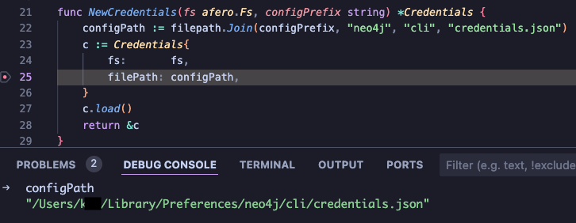
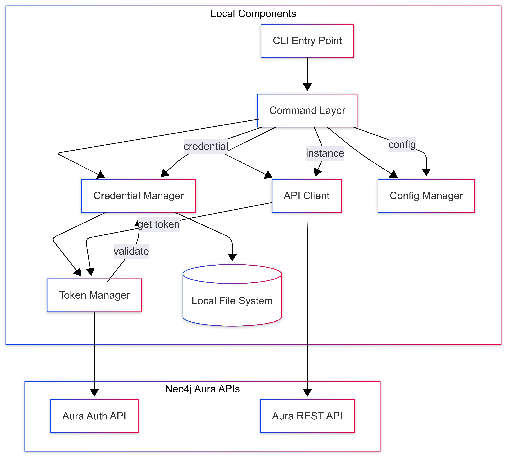

# neo4j-aura-go-cli

draft notes:

Command to set credentials

```bash

./neo4j-cli aura credential add --name "AuraDev1" --client-id AURA_CLIENT_ID --client-secret YOUR_AURA_CLIENT_SECRET
```

Command to state which credential (by name) to use:

```bash
./cli-binary aura credential use "AuraDev1"
```

Command to remove credential by name:

```bash
./cli-binary aura credential remove "CORRECT Aura API Credentials"
```

## Codebase

//TODO: add links to individual code
//TODO: clean up markdown for codebase directory-code for mo'better aesthetics

link to codebase - https://github.com/neo4j/aura-cli

### `aura-cli/common` directory

The common directory in the Aura CLI contains shared/core functionality used across different parts of the application

#### `aura-cli/common/clicfg` directory

The clicfg directory contains code for handling configuration files used by the CLI.

#### `aura-cli/common/clicfg/credentials` directory

The credentials directory contains code for handling credentials used by the CLI.

#### `clicfg/credentials/aura.go`

handles the core credential management for Neo4j Aura with the following key functionality:

- Stores and manages multiple Aura credentials (client ID/secret pairs)
- Handles default credential selection
- Manages OAuth access tokens and their expiration
- Provides CRUD operations for credentials:
  - Add(): Add new credentials
  - Remove(): Delete existing credentials
  - List(): Show all credentials
  - Get(): Retrieve specific credentials
  - SetDefault(): Set the default credential
- Token management:
  - UpdateAccessToken(): Updates access tokens with expiration
  - ClearAccessToken(): Removes access tokens
  - HasValidAccessToken(): Checks if token is still valid

#### `clicfg/credentials/credentials.go

This file handles the persistence layer for credentials with these features:

- Manages the credentials file storage (default: ~/neo4j/cli/credentials.json)
- Uses afero filesystem abstraction for better testability
- Handles:
  - File loading/saving
  - JSON serialization/deserialization
  - Automatic file creation if not exists
  - Safe file operations

The system is designed to:

- Store multiple sets of credentials securely
- Handle OAuth token lifecycle
- Provide a clean interface for credential management
- Persist credentials between CLI sessions
- Support default credential selection for convenience

#### `clierr` directory

The clierr directory contains code for handling errors in the CLI.

#### error.go

this file defines custom error types for the CLI application. It provides three distinct categories of errors:

1. NewUsageError(message string): Used for invalid command usage

- Used for user input/usage errors
- for example, invalid flags, missing required arguments

2. NewUpstreamError(message string):

- For temporary API/network issues
- rate limiting, temporary service unavailability
- Suggests that retrying might resolve the issue

3. NewFatalError(message string):

- Used for unrecoverable errors
- invalid credentials, missing required arguments
- Operation cannot be completed

#### `neo4j-cli` directory

#### `neo4j-cli/cli/main.go`

#### `neo4j-cli/aura` directory

Contains the core Neo4j Aura-specific CLI implementations

#### `neo4j-cli/aura/cmd` directory //TODO: dig deeper

/cmd: Command definitions

- Root Aura command
- Subcommands for instance, backup, user
- Command factories and builders

#### `neo4j-cli/aura/internal` directory

implementation details

#### `neo4j-cli/aura/internal/api` directory

- Aura API clients and models
- Instance management
- Backup operations
- User management
  GraphQL operations

#### `neo4j-cli/aura/internal/flags` directory

Contains command-line flag definitions like

- Common flags
- Instance flags
- Output format flags

#### `neo4j-cli/aura/internal/output` directory

Implementations for various output formatting logic

- Table formatting
- JSON output
- Error presentation

#### `neo4j-cli/aura/internal/subcommands` directory

#### `neo4j-cli/aura/internal/api` directory

## Debug Aura CLI commands locally

To debug the CLI commands locally with breakpoints, you have several options. Here's how you can set it up:

**Using VS Code Debug Configuration:**

Create a .vscode/launch.json file:

```json
{
  "version": "0.2.0",
  "configurations": [
    {
      "name": "Debug Aura CLI",
      "type": "go",
      "request": "launch",
      "mode": "debug",
      "program": "${workspaceFolder}/private/aura-cli/neo4j-cli/main.go",
      "args": ["aura-cli", "credential", "list"],
      "cwd": "${workspaceFolder}/private/aura-cli"
    },
    {
      "name": "Debug Credential Add",
      "type": "go",
      "request": "launch",
      "mode": "debug",
      "program": "${workspaceFolder}/private/aura-cli/neo4j-cli/main.go",
      "args": [
        "aura-cli",
        "credential",
        "add",
        "--name",
        "Debug_Credentials_Test",
        "--client-id",
        "${env:AURA_CLIENT_ID}",
        "--client-secret",
        "${env:AURA_CLIENT_SECRET}"
      ],
      "envFile": "${workspaceFolder}/.env",
      "cwd": "${workspaceFolder}/private/aura-cli"
    }
  ]
}
```

running the debug `Debug Credential Add` here we can see that aura-cli stores the credentials in the credentials.json file on a MacOS under the following path



this test is using the `Debug_Credentials_Test` name and the `AURA_CLIENT_ID` and `AURA_CLIENT_SECRET` are being pulled from a .env file. The CLI can be run locally without building by running the following command:

```bash
go run neo4j-cli/main.go
```

```bash
Allows you to manage Neo4j resources

Usage:
  neo4j-cli [command]

Available Commands:
  aura-cli    Allows you to programmatically provision and manage your Aura resources
  completion  Generate the autocompletion script for the specified shell
  help        Help about any command

Flags:
  -h, --help      help for neo4j-cli
  -v, --version   version for neo4j-cli

Use "neo4j-cli [command] --help" for more information about a command.
```

so for equivalent of the debug test above you can run the following command to add your credentials: (requires .env file, and an aura client id and secret you should have already created in your aura console)

```bash
go run neo4j-cli/main.gocredential add --name Debug_Credentials_Test --client-id ${AURA_CLIENT_ID} --client-secret ${AURA_CLIENT_SECRET}
```

You can read back your stored credentials using subcommand `get`

```bash
% go run neo4j-cli/main.go aura-cli credential list | jq 'walk(if type == "string" then (.[:5] +"*****") else . end)'
[
  {
    "name": "Debug*****",
    "client-id": "*****",
    "client-secret": "*****",
    "access-token": "*****",
    "token-expiry": 0
  }
]
```

## High Level Architecture




## Instance Management

/instance
├── create.go       # instance creation
├── delete.go       # instance deletion
├── get.go         # get instance details
├── instance.go    # main instance command
├── list.go        # list instances
└── snapshot/      # snapshot management
    ├── create.go
    ├── get.go
    ├── list.go
    └── snapshot.go


### Creation/Deletion
Sizing/Scaling
Backups/Snapshots
CMEK integration (we started this)
Status monitoring
